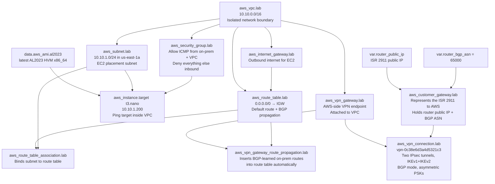
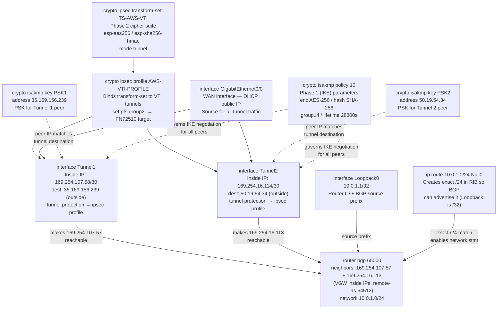
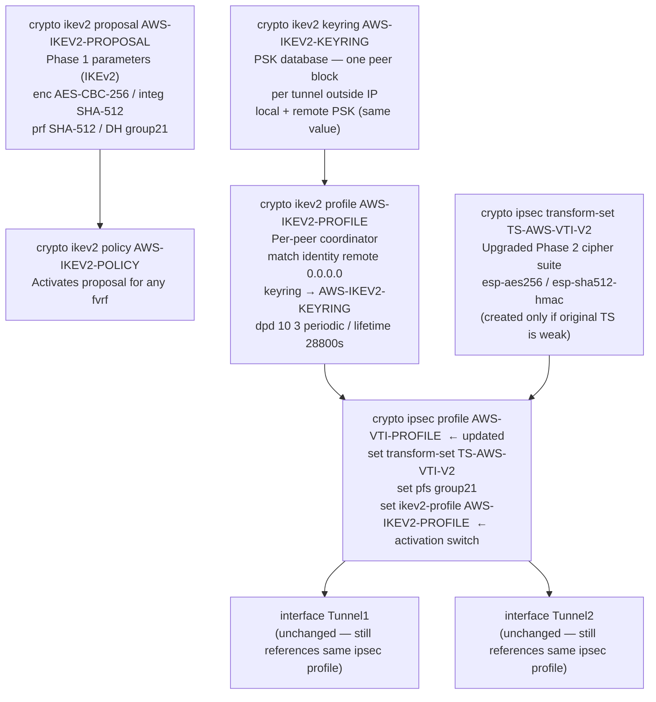

# Dependency Graphs

---

## AWS Lab Object Dependencies

Every resource the lab Terraform creates, what it does, and what it depends on.
Arrows mean "depends on / references."



### BGP route propagation flow (runtime, not a Terraform dependency)

```
ISR 2911                       AWS VGW                    VPC Route Table
────────                       ───────                    ───────────────
router bgp 65000         BGP session over          aws_vpn_gateway_
  network 10.0.1.0/24 ──▶ tunnel inside IPs  ──▶  route_propagation
                           (169.254.x.x)            inserts 10.0.1.0/24
                                                     → vgw-01d4b1add27b92d27
```

---

## Cisco IKEv1 VTI + BGP Config Dependencies

Objects present on the router **before** migration. Arrows mean "references / depends on."



**Solid arrows** = hard config reference (object A names object B).  
**Dashed arrows** = runtime dependency (A won't work without B, but A doesn't name B in config).

---

## Cisco IKEv2 Migration Additions

Objects the migration tool **adds** to the existing config. The ipsec profile is updated in-place; everything else is new. Existing IKEv1 objects are not shown but remain untouched.



### What the activation switch does

```
crypto ipsec profile AWS-VTI-PROFILE
  set ikev2-profile AWS-IKEV2-PROFILE   ← present  → IKEv2 initiates on next renegotiation
                                         ← absent   → IKEv1 (full rollback)
```

The tunnel interfaces and BGP config require **zero changes**. BGP neighbors operate over the same 169.254.x.x/30 inside IPs regardless of whether the tunnel is protected by IKEv1 or IKEv2.

---

## Full Stack: How a Packet Gets Encrypted (VTI Path)

```
Application packet: 10.0.1.1 → 10.10.1.200
        │
        ▼
┌─ Routing table ─────────────────────────────────────────────┐
│  10.10.0.0/16 via Tunnel1 (BGP-learned from VGW)           │
└─────────────────────────────────────────────────────────────┘
        │
        ▼
┌─ interface Tunnel1 ─────────────────────────────────────────┐
│  tunnel protection ipsec profile AWS-VTI-PROFILE           │
│    → looks up IPsec SA for tunnel destination 35.169.x.x   │
│    → if no SA: triggers IKE (v1 or v2 per profile config)  │
└─────────────────────────────────────────────────────────────┘
        │
        ▼
┌─ IKE negotiation (one-time, on SA miss) ────────────────────┐
│  Phase 1: isakmp policy / ikev2 proposal                   │
│    → agree on enc/hash/DH, derive shared key               │
│  Phase 2: ipsec profile → transform-set                    │
│    → agree on ESP cipher, derive session keys              │
└─────────────────────────────────────────────────────────────┘
        │
        ▼
┌─ ESP encapsulation ─────────────────────────────────────────┐
│  Inner packet: 10.0.1.1 → 10.10.1.200                     │
│  Outer packet: GigEth0/0-IP → 35.169.156.239 (UDP 4500)   │
└─────────────────────────────────────────────────────────────┘
        │
        ▼
    Public internet → AWS VGW decapsulates → 10.10.1.200 (EC2)
```
