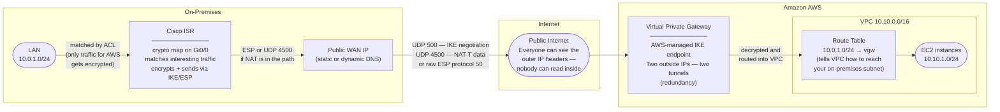
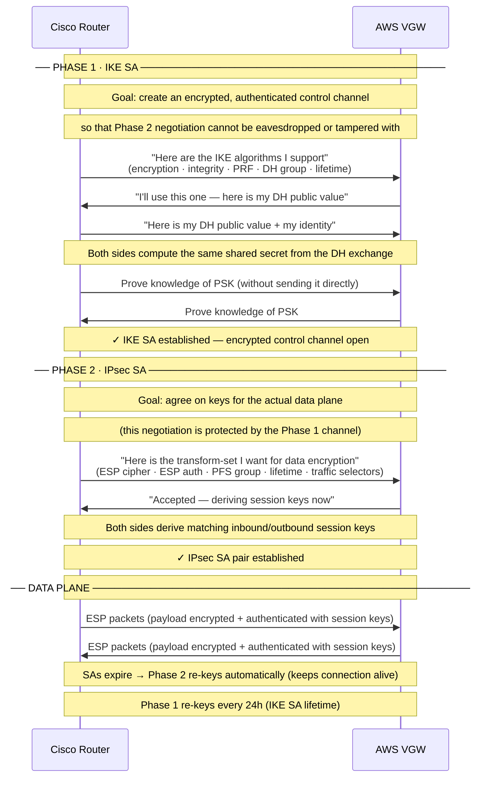
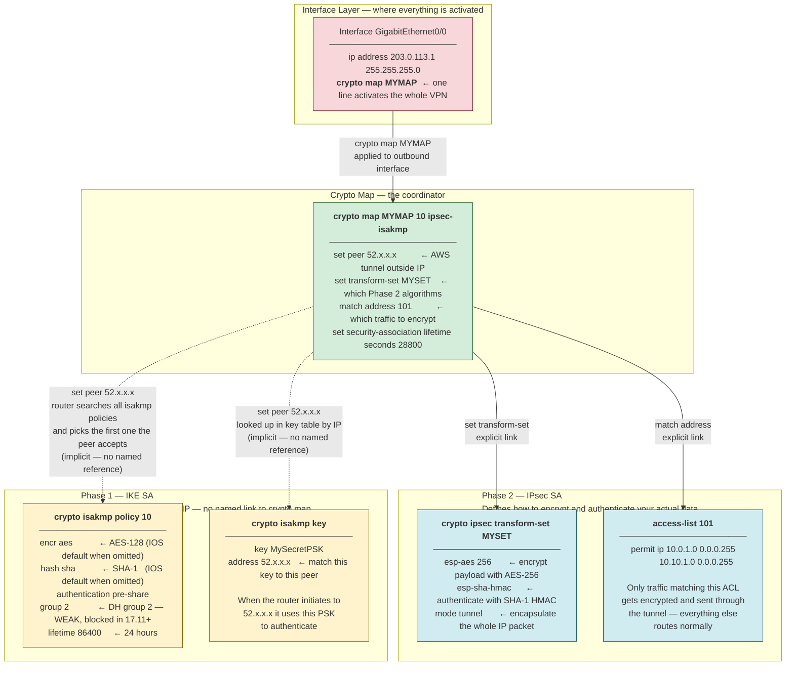
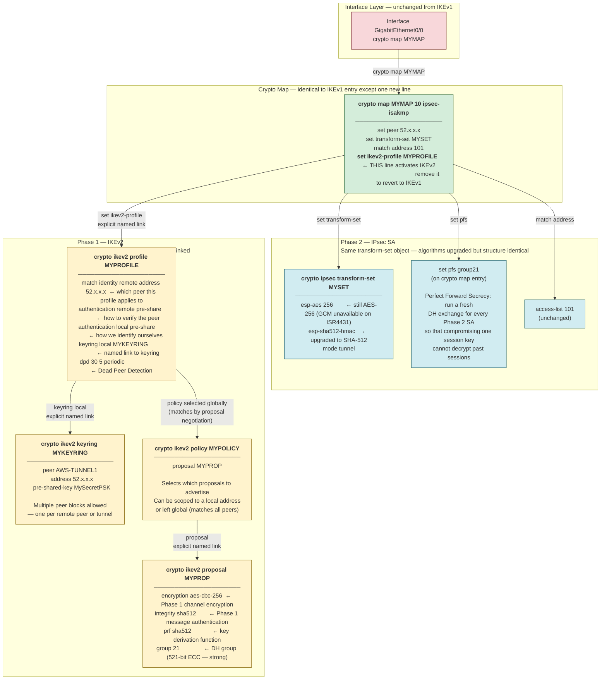
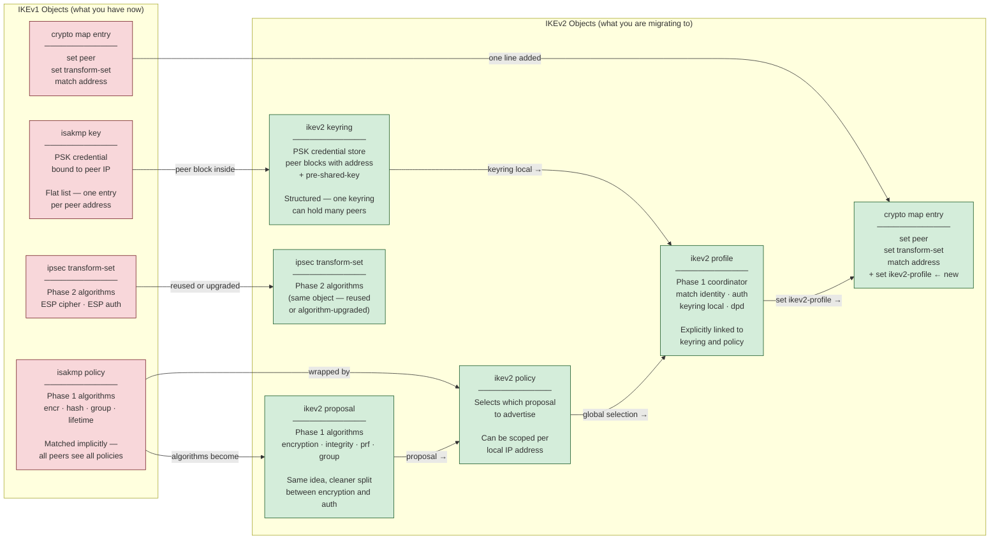
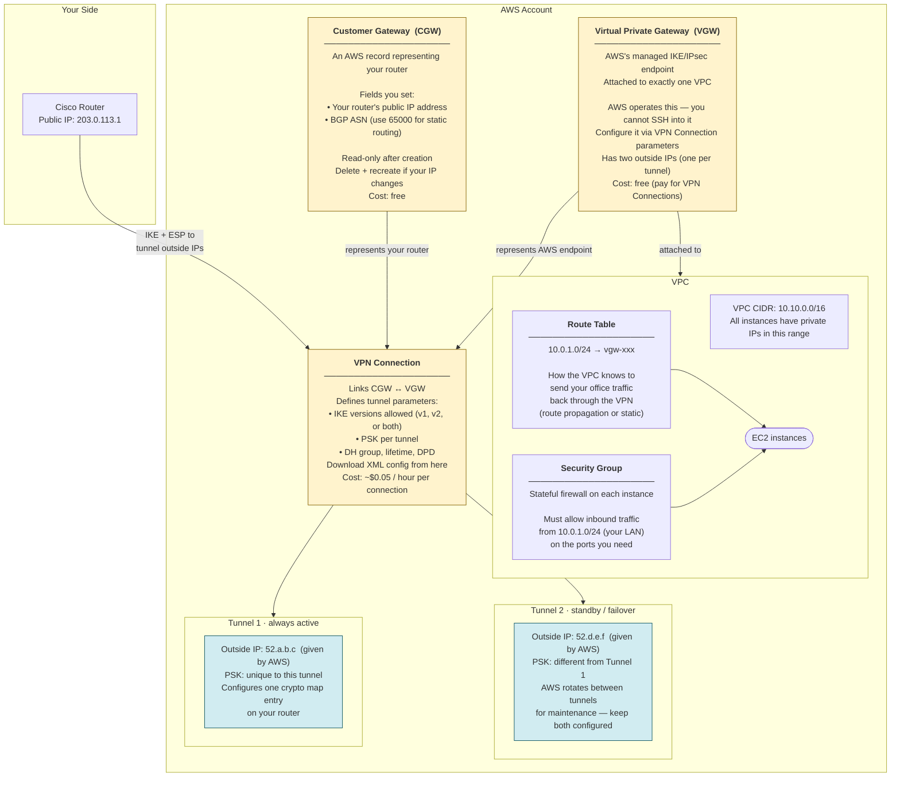
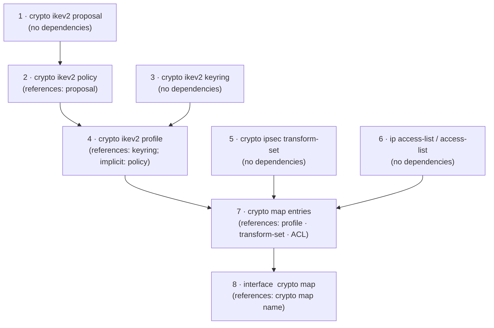
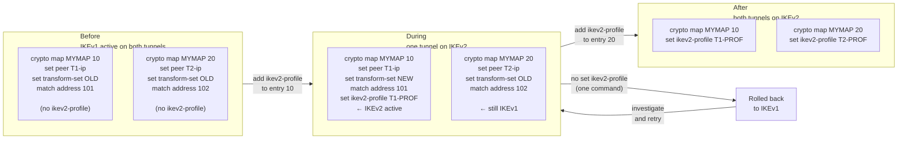

# IPsec VPN Primer: Cisco IOS + AWS

*A visual guide for people who are new to IPsec, IKE, and AWS networking.
No prior VPN experience assumed — just a basic understanding of IP routing.*

---

## Part 1 — Concepts: Why Any of This Exists

### The Problem

Your office has servers on a private network (say, `10.0.1.0/24`). AWS has your cloud workloads on a private VPC (`10.10.0.0/16`). These two networks need to talk to each other — but the only path between them is the public internet, where anyone can read or tamper with your traffic.

You need a way to send private traffic over a public network **securely**.

That is exactly what IPsec does.

---

### What IPsec Actually Is

**IPsec** (Internet Protocol Security) is a suite of standards for encrypting and authenticating IP traffic between two endpoints. It is not a single protocol — it is a framework of several cooperating pieces:

- **IKE** (Internet Key Exchange) — the negotiation protocol that runs first, agrees on algorithms, and creates shared keys
- **ESP** (Encapsulating Security Payload) — the protocol that actually wraps your data packets with encryption and authentication
- **SA** (Security Association) — a record of agreed-upon parameters (algorithms, keys, lifetime) for a single direction of traffic

Think of it in three acts:

```
Act 1 — Introduce yourselves and agree on a secret language   (IKE Phase 1)
Act 2 — Use that secret language to agree on how to seal mail  (IKE Phase 2)
Act 3 — Start sealing and sending mail                         (ESP data plane)
```

---

### The Envelope Analogy

Imagine you are sending a letter from your office to AWS. Without IPsec, you drop the letter (your IP packet) into the regular postal system — anyone handling it can read it.

With IPsec:

1. You seal your letter in a **locked box** (ESP encryption).
2. You write the destination address on the *outside* of the box — the internet can route it, but cannot see inside.
3. When AWS receives the box, they have the same lock combination and open it.

```
Original packet:     [ IP header | TCP | your data ]
After ESP tunnel:    [ outer IP | ESP header | 🔒 encrypted( IP header | TCP | your data ) | ESP auth ]
                        ↑                                                                         ↑
                   routable on internet                                           tamper-evident seal
```

The outer IP header gets the packet to the VPN endpoint. The inner IP header (encrypted) carries the real source and destination. Neither is visible to anyone in between.

---

### The Key Problem: How Do Two Strangers Agree on a Secret?

Before encrypting anything, both sides need to agree on **which encryption algorithm to use** and **what key to use**. But they can only communicate over the public internet. How do you agree on a secret when anyone could be listening?

The answer is **Diffie-Hellman (DH) key exchange** — one of the most elegant ideas in cryptography.

**The paint mixing analogy** (Diffie-Hellman in plain English):

```
1. Alice and Bob both start with the same public color: YELLOW
2. Alice picks a secret color: RED    → mixes with yellow → sends ORANGE to Bob
3. Bob picks a secret color: BLUE    → mixes with yellow → sends GREEN to Alice
4. Alice mixes her secret RED  with Bob's GREEN  → BROWN
5. Bob  mixes his secret BLUE with Alice's ORANGE → BROWN (same!)

An eavesdropper sees YELLOW, ORANGE, GREEN — but cannot reverse-engineer BROWN
without knowing RED or BLUE.
```

In real DH, "colors" are enormous prime numbers. The **DH group** number (group 2, group 21, etc.) specifies the size of those numbers — larger group = harder to crack = more CPU.

> **Why this matters for FN72510:** DH groups 1, 2, and 5 use numbers small enough that a well-funded attacker can crack them today. Cisco 17.11+ refuses to use them.

---

### Authentication: How Do You Know You're Talking to AWS?

DH solves the "agree on a secret" problem, but it doesn't prove *who* you are agreeing with. A man-in-the-middle could intercept and run DH with both sides simultaneously.

This is where **authentication** comes in. There are two common methods:

| Method | How it works | Used in this setup |
|--------|-------------|-------------------|
| **Pre-Shared Key (PSK)** | Both sides have the same secret string configured in advance | ✓ AWS VPN uses PSK |
| **PKI / certificates** | Each side has a certificate signed by a trusted CA | Used in large enterprise deployments |

With PSK: after the DH exchange, both sides **prove they know the shared secret** without transmitting it directly. If both sides can verify the proof, they know they are talking to the right peer (and not a man-in-the-middle who doesn't know the PSK).

> **AWS PSKs:** Each VPN tunnel has its own PSK. Tunnel 1 and Tunnel 2 have *different* PSKs. AWS and your router use the *same* PSK for a given tunnel (symmetric) — there is no concept of a "local PSK" vs "remote PSK" for pre-shared keys.

---

### What Are Security Associations (SAs)?

A **Security Association** is a one-way agreement: "traffic flowing in *this* direction will be encrypted with *these* algorithms using *this* key, and expires in *this* many seconds."

Because SAs are one-directional, a working IPsec tunnel always has at least two:
- One SA for traffic flowing **from you to AWS**
- One SA for traffic flowing **from AWS to you**

SAs have a **lifetime** — after a configurable number of seconds (or kilobytes of data), the SA expires and the two sides **re-key**: they run a fresh key exchange and generate new session keys. This limits how much data any single key can be used to decrypt, even if it were stolen.

```
IKE SA (Phase 1):     lifetime 86400s (24h)   — protects the control channel
IPsec SA (Phase 2):   lifetime 3600s  (1h)    — protects the data; re-keys more often
                      (AWS uses 28800s by default)
```

---

### IKEv1 vs IKEv2

Both accomplish the same goal. IKEv2 is the modern version (RFC 7296, 2014):

| | IKEv1 | IKEv2 |
|--|-------|-------|
| Message exchanges to establish SA | 6 or 9 | 4 |
| NAT traversal (UDP 4500) | bolted on | built in |
| Dead Peer Detection | optional extension | built in |
| Asymmetric authentication | no | yes |
| Resistance to DoS amplification | poor | improved |
| Config objects on Cisco | `isakmp policy` / `isakmp key` | `ikev2 proposal` / `ikev2 policy` / `ikev2 keyring` / `ikev2 profile` |

IKEv1 still works but Cisco is removing support for its weak-algorithm modes under **FN72510**, and the cleaner object model of IKEv2 is worth the migration.

---

### NAT Traversal (NAT-T): IPsec Through a Home Router or Firewall

ESP is a raw IP protocol (protocol number 50) — it has no TCP or UDP port numbers. Most NAT devices (home routers, firewalls) need port numbers to track connections, so they cannot translate ESP packets.

**NAT-T solves this** by wrapping ESP inside UDP port 4500. If either side detects NAT in the path (by comparing observed and reported IP addresses during IKE), they automatically switch to UDP 4500 for the data plane.

```
No NAT in path:    IKE on UDP 500  +  ESP (protocol 50) direct
NAT in path:       IKE on UDP 500  →  switches to UDP 4500 for both IKE and ESP
                   (your firewall must pass UDP 500 AND UDP 4500 inbound)
```

---

### AWS Networking Concepts

If you are new to AWS networking, three objects matter for VPN:

**VPC (Virtual Private Cloud)**
Your private network in AWS. Think of it as a walled garden: all your EC2 instances live inside with private IP addresses, invisible to the internet by default. A VPC has a CIDR block (e.g., `10.10.0.0/16`) that defines its address space.

**Virtual Private Gateway (VGW)**
AWS's VPN endpoint — a managed IKE/IPsec server attached to your VPC. You do not log into it or configure it with CLI commands; you configure it by modifying the *VPN Connection* object via the AWS console or API. The VGW has two outside IP addresses (one per tunnel) for redundancy.

**Customer Gateway (CGW)**
A record in AWS that represents *your* router: its public IP address and (optionally) a BGP ASN. AWS uses this to know who is allowed to connect. If your router's public IP changes (e.g., dynamic DNS), you must delete and recreate the CGW.

**VPN Connection**
The object that links a CGW to a VGW and defines the tunnel parameters: IKE versions, PSKs, DH groups, lifetimes. Downloading the config XML from this object gives you everything you need to configure your router.

---

## Part 2 — The Architecture

### The Big Picture



**"Interesting traffic"** is a key concept: the crypto map does not encrypt *everything* the router forwards. An ACL (access control list) defines which source/destination address pairs should be encrypted. Traffic not matching the ACL goes out unencrypted as normal. This is sometimes called *policy-based VPN* (as opposed to route-based VPN where routing tables direct traffic into a tunnel interface).

---

### The Two-Phase Handshake

Every time the VPN needs to carry traffic and there is no active SA, IKE runs this sequence:



---

## Part 3 — Cisco Config Objects

### How Cisco Organises This

Cisco represents every IKE and IPsec concept as a named config object. Understanding which object belongs to which phase — and how they reference each other — is the key to reading and writing VPN config.

The central object is the **crypto map**. Think of it as the coordinator that ties everything together and hands off to Phase 1 and Phase 2 in the right order.

---

### IKEv1 Objects

In IKEv1, Phase 1 matching is **implicit**: when a peer initiates IKE, the router tries every `isakmp policy` in priority order until the peer agrees on one. There is no explicit named link between the crypto map and the policy.



**Object summary for IKEv1:**

| Object | What it is | Key settings |
|--------|-----------|-------------|
| `isakmp policy` | Phase 1 algorithm set | `encr`, `hash`, `auth`, `group`, `lifetime` — offered to all peers |
| `isakmp key` | PSK bound to a peer IP | `key <string> address <ip>` — use `address 0.0.0.0` to match any peer |
| `ipsec transform-set` | Phase 2 algorithm set | ESP encryption cipher, ESP auth, `mode tunnel` |
| `crypto map` entry | Main coordinator | `set peer`, `set transform-set`, `match address`, `lifetime` |
| Interface `crypto map` | Activation | One line on the WAN-facing interface |

> **IOS default behavior:** If `encr` or `hash` lines are missing from an `isakmp policy`, IOS uses AES-128 and SHA-1 respectively — but does **not** show these lines in `show running-config`. This trips up parsers: a policy with no encryption line is *not* unconfigured — it is using AES-128.

---

### IKEv2 Objects

IKEv2 replaces the implicit Phase 1 matching with explicit, named objects. The result is more configuration lines but far clearer intent — every link between objects is visible in the config.

The new central object for Phase 1 is the **ikev2 profile**, which takes over the role that `isakmp policy` + `isakmp key` played together in IKEv1.



**Object summary for IKEv2:**

| Object | What it is | Key settings |
|--------|-----------|-------------|
| `ikev2 proposal` | Phase 1 algorithm bundle | `encryption`, `integrity`, `prf`, `group` |
| `ikev2 policy` | Selects which proposals to offer | `proposal <name>` — can be scoped per local address |
| `ikev2 keyring` | PSK store, structured by peer | `peer` blocks each with `address` + `pre-shared-key` |
| `ikev2 profile` | Phase 1 coordinator | `match identity`, `authentication`, `keyring local`, `dpd` |
| `ipsec transform-set` | Phase 2 algorithm set | Same as IKEv1 — reused unchanged |
| `crypto map` entry | Coordinator | Same as IKEv1, gains `set ikev2-profile` |

**Why three Phase 1 objects (proposal / policy / profile)?**

- **Proposal** = the algorithm bundle. Define one per strength level you want to support.
- **Policy** = which proposals to advertise, and to whom. A global policy applies to all peers; a per-address policy lets you offer strong-only algorithms to your AWS peers while still supporting weaker algorithms for a legacy partner.
- **Profile** = everything that is *per-peer*: which keyring holds that peer's PSK, how to match that peer's identity, DPD settings, virtual-template if using VTI. One profile per tunnel (or per group of tunnels sharing a PSK).

---

### IKEv1 → IKEv2: What Changes, What Stays



---

## Part 4 — AWS Side Objects



**Two tunnels, two PSKs — a common source of confusion:**

AWS always creates two tunnels per VPN connection for redundancy. Each tunnel has:
- A different AWS outside IP address
- A **different PSK** (symmetric, but unique per tunnel)
- Independent IKE SAs and IPsec SAs

Your router needs **one crypto map entry per tunnel**. Each entry points to the correct peer IP and uses the correct PSK in the keyring. If you only configure Tunnel 1, the VPN works but has no redundancy — AWS can silently migrate maintenance to Tunnel 2 and your traffic stops until it times out and re-initiates.

```
Tunnel 1    AWS outside IP: 52.a.b.c    PSK: xyzABC...    ← crypto map seq 10
Tunnel 2    AWS outside IP: 52.d.e.f    PSK: qrsQRS...    ← crypto map seq 20
                                              ↑ different key — do not mix these up
```

**Route table: the often-forgotten step**

The VPN tunnel carrying encrypted traffic is only half the picture. AWS also needs to know how to *route* return traffic back through the VPN. This is done by adding a route to the VPC route table:

```
Destination: 10.0.1.0/24   →   Target: vgw-0xxxxxxxxxx
```

Without this route, traffic from EC2 to your office has no path — it will be dropped. You can add this manually in the AWS console, or enable *route propagation* on the VGW to have it add routes automatically based on the traffic selectors negotiated during IKE.

---

## Part 5 — Reference

### Algorithm Slots: Phase 1 vs Phase 2

The same algorithm names appear in both phases — but they protect *different things*.

```
PHASE 1 algorithms protect: the IKE control channel (negotiation messages)
PHASE 2 algorithms protect: your actual data (the ESP payload)
```

#### Phase 1 — `isakmp policy` (IKEv1) / `ikev2 proposal` (IKEv2)

| Slot | IKEv1 keyword | IKEv2 keyword | Protects |
|------|--------------|--------------|---------|
| Encryption | `encr aes 256` | `encryption aes-cbc-256` | IKE control channel payload |
| Integrity | `hash sha512` | `integrity sha512` | IKE message authenticity |
| PRF | *(same as hash in v1)* | `prf sha512` | Key derivation function |
| DH Group | `group 21` | `group 21` | Key exchange strength |
| Lifetime | `lifetime 86400` | *(profile or default)* | How often to re-key the IKE SA |

#### Phase 2 — `ipsec transform-set`

| Slot | Keyword | Protects |
|------|---------|---------|
| ESP encryption | `esp-aes 256` | Data payload (confidentiality) |
| ESP integrity | `esp-sha512-hmac` | Data payload (tamper detection) |
| PFS | `set pfs group21` *(on crypto map)* | Each session key is independent |
| Mode | `mode tunnel` | Encapsulates entire IP packet |
| Lifetime | `set security-association lifetime` *(on crypto map)* | How often to re-key the IPsec SA |

---

### FN72510 Blocked Algorithms (Cisco IOS XE 17.11+)

These algorithms are cryptographically weak or broken. Cisco blocks them at 17.11 and above.

| Blocked setting | Why it is dangerous |
|----------------|-------------------|
| `encr des` / `encr 3des` | DES is brute-forceable; 3DES has known weaknesses |
| `esp-des` / `esp-3des` | Same |
| `hash md5` / `esp-md5-hmac` | MD5 is collision-broken — an attacker can forge authenticated packets |
| `group 1` | 768-bit DH — crackable with commodity hardware |
| `group 2` | 1024-bit DH — within reach of nation-state adversaries |
| `group 5` | 1536-bit DH — borderline, also blocked |
| `group 24` | 2048-bit MODP with 256-bit subgroup — specific structural weakness |

**What to use instead:** AES-256 for encryption, SHA-256 or SHA-512 for integrity/hash, DH group 14 (2048-bit, minimum safe) or group 19/20/21 (elliptic curve, strongest).

---

### Configuration Build Order

Objects must exist before they are referenced. Create them in this order:



---

### The Additive Migration Strategy

Because `set ikev2-profile` is per crypto map entry, IKEv1 and IKEv2 coexist on the same router. You migrate one tunnel at a time. If something goes wrong, one command rolls back.



---

### Verification Commands

After applying IKEv2 config, these commands confirm the tunnel is working:

```
show crypto ikev2 sa          — should show READY state, peer IP, algorithms used
show crypto ipsec sa          — shows inbound/outbound SAs, packet counters
show crypto ikev2 session     — detailed per-session view
debug crypto ikev2             — verbose negotiation trace (use carefully in production)
```

Expected healthy output:

```
Router# show crypto ikev2 sa
 IPv4 Crypto IKEv2  SA

Tunnel-id Local                 Remote                fvrf/ivrf            Status
1         203.0.113.1/500       52.x.x.x/500          none/none            READY
      Encr: AES-CBC, keysize: 256, PRF: SHA512, Hash: SHA512, DH Grp:21, Auth sign: PSK, Auth verify: PSK
      Life/Active Time: 86400/3412 sec
```

---

---

## Part 6 — Rosetta Stone: Cisco ↔ AWS Terminology

If you have spent your career configuring Cisco routers and switches, AWS networking feels like the same concepts described by someone who has never touched a router. This section maps what you already know to what AWS calls it.

---

### The Core Mental Model Shift

On a Cisco router, you configure **interfaces**, attach **policies** to them, and the box forwards packets. You can SSH in, run `show` commands, and see exactly what is happening.

In AWS, there is no box you can SSH into. The network is **software-defined**: you create objects (VPC, Route Table, Security Group) through an API, and AWS's infrastructure enforces them. The "router" is invisible — you configure it indirectly by editing Route Table entries.

```
Cisco mindset:                          AWS mindset:
  Physical box with interfaces            Logical objects managed via API
  CLI: conf t → interface → policy        Console / Terraform / CLI
  "show" commands for everything          CloudWatch metrics + Flow Logs
  Config file you own                     State stored in AWS
  Changes take effect immediately         Changes take seconds to propagate
```

---

### Topology and Addressing

| Cisco concept | AWS equivalent | Key differences |
|---|---|---|
| **VRF** | **VPC** (Virtual Private Cloud) | Closest analog. Each VPC is fully isolated. No route leaking without explicit configuration. |
| **VLAN / SVI** | **Subnet** | In AWS, a subnet is tied to one Availability Zone. No spanning-tree, no trunking. |
| **IP routing table** | **Route Table** | AWS Route Tables are explicit objects you create and associate to subnets. There is no single global table. |
| **Default gateway** | **VPC Router** (implicit) | Every VPC has a built-in router you can't see or SSH into. It handles all inter-subnet and gateway traffic. You control it by editing Route Table entries. |
| **Static route** (`ip route`) | **Route Table entry** | Same idea: destination CIDR → next-hop target. Targets can be IGW, VGW, TGW, ENI, etc. |
| **Loopback interface** | **Elastic IP (EIP)** | A stable public address that follows an instance across restarts. Not the same concept technically, but serves the same "stable identity" purpose. |
| **Subinterface** | **Secondary IP / ENI** | An instance can have multiple ENIs, each with multiple IPs. |
| **Port-channel / LAG** | Not configurable | AWS manages physical redundancy transparently. You don't bond uplinks. |
| **SPAN / port mirror** | **VPC Traffic Mirroring** | Copies traffic from ENIs to a monitoring destination. Requires specific instance types. |

---

### Internet and WAN Connectivity

| Cisco concept | AWS equivalent | Key differences |
|---|---|---|
| **WAN interface** (with public IP) | **Internet Gateway (IGW)** + Elastic IP | The IGW is a VPC-level gateway. Instances get public IPs via EIP or auto-assign. The IGW does 1:1 NAT between private and public IP. |
| **PAT / NAT overload** | **NAT Gateway** | A managed service in a subnet. Private instances send outbound traffic through it. No inbound initiated connections (same as PAT). |
| **Static NAT** (one-to-one) | **Elastic IP** assigned to instance | The IGW performs the translation transparently. |
| **MPLS / leased line** | **AWS Direct Connect** | Dedicated physical connection to an AWS region. Bypasses the public internet. Lower latency, consistent throughput. |
| **IPsec VPN** | **Site-to-Site VPN** | AWS-managed IKE/IPsec endpoint (VGW). Same protocols, different CLI. See table below. |
| **DMVPN hub** | **Transit Gateway (TGW)** | Regional hub that connects VPCs, VPNs, and Direct Connect circuits. Equivalent to a hub router in a hub-and-spoke design. |
| **GRE tunnel** | **VPC Peering** or **TGW** | VPC Peering connects two VPCs directly (like a GRE tunnel between two routers). TGW is the hub-and-spoke version. |

---

### VPN-Specific Concepts

| Cisco concept | AWS equivalent | Notes |
|---|---|---|
| `crypto map` (the coordinator) | **VPN Connection** | The top-level VPN object. Links a CGW to a VGW. Contains tunnel options, PSKs, IKE settings. |
| `crypto isakmp key` / PSK | **Pre-Shared Key in VPN Connection** | One PSK per tunnel. Set in Tunnel Options. Symmetric — same value on both sides. |
| `set peer <ip>` | **Tunnel outside IP** (from VGW) | AWS assigns the VGW tunnel IPs. You configure `set peer` on your router to point at them. |
| `match address` ACL | **Traffic Selectors** | What subnets are permitted through the tunnel. AWS uses `0.0.0.0/0` by default (route-based); your router uses an ACL (policy-based). |
| `crypto isakmp policy` | **Phase 1 options in Tunnel Options** | Encryption, integrity, DH group, lifetime — configured per-tunnel in the VPN Connection. |
| `crypto ipsec transform-set` | **Phase 2 options in Tunnel Options** | ESP encryption, ESP integrity, PFS group, lifetime. |
| `isakmp keepalive` (DPD) | **DPD (Dead Peer Detection)** | Built into IKEv2. AWS always sends DPD. If your router doesn't respond, AWS marks the tunnel DOWN. Configure `dpd` in your IKEv2 profile. |
| `show crypto isakmp sa` | **VPN Connection → Tunnel Details (UP/DOWN)** | AWS updates tunnel status within ~60 seconds of an IKE state change. |
| `show crypto ipsec sa` encaps/decaps | **CloudWatch metric: TunnelDataIn / TunnelDataOut** | Packet counters are not shown directly in the console. Use CloudWatch or check router-side. |
| Customer gateway (your router) | **Customer Gateway (CGW)** | An AWS record of your router's public IP and BGP ASN. Read-only after creation. |
| IKE endpoint (your router's WAN IP) | **Virtual Private Gateway (VGW)** | AWS's managed IKE server. Attached to one VPC. Has two outside IPs (two tunnels). |
| Two tunnels per VPN | **Two tunnels per VPN Connection** | AWS always creates two tunnels. Each has a different outside IP and PSK. Configure both on your router for redundancy. |

---

### Firewalling and Access Control

| Cisco concept | AWS equivalent | Key differences |
|---|---|---|
| **Interface ACL** (stateless, in/out) | **Network ACL (NACL)** | Stateless like an interface ACL. Applied to a subnet, not an instance. Rules have explicit allow and deny, numbered for priority. Return traffic needs an explicit permit. |
| **Zone-based firewall** / **ASA** | **Security Group** | Stateful — return traffic is automatically permitted. Applied to a network interface (ENI), not a zone or interface. Default: deny all inbound, permit all outbound. |
| `permit tcp host A host B eq 443` | Security Group inbound rule: TCP 443 from A | Security Groups don't have sequence numbers or deny rules (default deny handles it). |
| `deny ip any any log` | No equivalent in Security Group | Security Group implicit deny is silent. Use VPC Flow Logs to capture denied traffic. |
| ACL applied inbound on WAN | NACL on the subnet + Security Group on instance | You typically layer both: NACL for broad subnet-level policy, SG for per-instance policy. |
| **AAA / RADIUS / TACACS** | **IAM** (Identity and Access Management) | Controls who can call the AWS API (create/delete resources). Not a network-level firewall — it controls the control plane. |

---

### Routing Protocols and Dynamics

| Cisco concept | AWS equivalent | Key differences |
|---|---|---|
| **OSPF / EIGRP** | Not available | AWS has no IGP between VPCs. Routing is static (Route Table entries) or via BGP over VPN/Direct Connect. |
| **BGP** | BGP over Site-to-Site VPN or Direct Connect | Used only for dynamic route exchange with on-prem. Not used inside a VPC. |
| **Route redistribution** | **Route propagation** | When enabled on a Route Table, the VGW automatically adds routes it learns via BGP. Equivalent to `redistribute bgp` into the local table. |
| **Floating static route** | Route Table with multiple entries | AWS selects the most specific route. No administrative distance concept. |
| **ECMP** | Supported on Transit Gateway | Multiple equal-cost paths to the same destination. Not available on VGW-based VPN. |
| **Summarization** | CIDR aggregation in Route Table | You create summary routes manually. No auto-summary. |

---

### Observability and Operations

| Cisco concept | AWS equivalent | Notes |
|---|---|---|
| `show interface` | **CloudWatch → EC2 network metrics** | Bytes/packets in/out per ENI. No equivalent of `input rate`, `output drops`, CRC errors. |
| `show ip route` | **Route Table in AWS Console** | Exactly what is in the routing table for a subnet. No runtime state — what you see is what is enforced. |
| `debug ip packet` | **VPC Flow Logs** | Logs connection-level metadata (src IP, dst IP, port, action) to CloudWatch Logs or S3. Not full packet capture. |
| Full packet capture | **VPC Traffic Mirroring** | Requires supported instance types. Mirrors raw traffic to a monitoring ENI. |
| `traceroute` | **VPC Reachability Analyzer** | Traces the logical network path between two resources. Shows which Security Group or NACL is blocking. Does not measure latency. |
| `ping` (from AWS side) | **EC2 Instance Connect / SSM Session Manager** | SSH into an instance and ping from there. There is no equivalent of pinging from the VPC Router itself. |
| Syslog | **CloudWatch Logs** | Application and OS logs. VPC Flow Logs for network metadata. |
| SNMP traps | **CloudWatch Alarms + SNS** | Define a metric threshold → send a notification. No SNMP polling of network devices. |
| NTP | **Amazon Time Sync Service** | Available at `169.254.169.123` from any instance. No configuration needed. |
| `show version` | **Instance metadata / AWS Console** | AMI ID, instance type, region, AZ at `http://169.254.169.254/latest/meta-data/`. |

---

### Geography and Redundancy

| Cisco concept | AWS equivalent | Notes |
|---|---|---|
| **Physical data center / site** | **Region** (e.g., `us-east-1`) | A geographic cluster of data centers. Resources in one region can't directly access resources in another without explicit connectivity. |
| **Building / failure domain** | **Availability Zone (AZ)** (e.g., `us-east-1a`) | Independent power, cooling, and networking within a region. Subnets are tied to one AZ. Distribute resources across AZs for redundancy. |
| **Rack / chassis** | Abstracted away | AWS manages physical redundancy. You design for AZ-level failures, not rack failures. |
| **Dual-homed link / HSRP** | **Multiple ENIs / Elastic Load Balancer** | For network-level redundancy, use multiple ENIs or put instances behind a load balancer. |
| **Out-of-band management** | **AWS Systems Manager (SSM)** | Access instances without SSH or a public IP. Works through the AWS control plane. Equivalent of a console server. |

---

### Configuration Management

| Cisco concept | AWS equivalent | Notes |
|---|---|---|
| **IOS config file** (`running-config`) | **Terraform state / CloudFormation stack** | Infrastructure-as-code is the AWS-native way to manage config. The "running state" is what's in AWS; Terraform state tracks what you deployed. |
| `copy running-config startup-config` | **Terraform / CloudFormation is the source of truth** | There is no startup-config. Resources exist until deleted. Reboot doesn't change config. |
| `write erase` / factory reset | `terraform destroy` | Deletes all resources defined in the Terraform config. |
| `show running-config` | AWS Console / `aws ec2 describe-*` CLI | Query the current state via the API. `aws ec2 describe-vpcs`, `describe-route-tables`, etc. |
| Hostname | **Tags** (especially `Name` tag) | AWS identifies resources by ID (e.g., `vpc-0abc1234`). The `Name` tag is just a label. Searching and filtering uses tags. |
| Config version control (RANCID, etc.) | **Git + Terraform** | Check your `.tf` files into git. The state file (`terraform.tfstate`) should be in S3 with versioning for team use. |

---

*Companion to `ikev1_to_ikev2_migrate.py` and `HOWTO.md` in this directory.*
